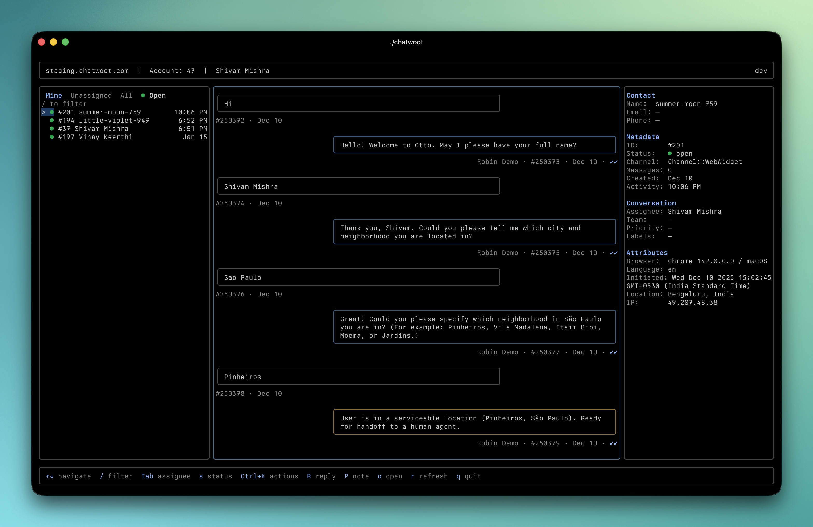

# chatwoot-cli

Interactive TUI and CLI for [Chatwoot](https://www.chatwoot.com) — manage conversations, send messages, and reply to customers from your terminal.



## Install

```bash
go install github.com/chatwoot/chatwoot-cli/cmd/chatwoot@latest
```

Or build from source:

```bash
git clone https://github.com/chatwoot/chatwoot-cli.git
cd chatwoot-cli
go build -o chatwoot ./cmd/chatwoot/
```

## Setup

```bash
chatwoot auth login
```

You'll be prompted for:
- **Base URL** — your Chatwoot instance (e.g. `https://app.chatwoot.com`)
- **API Key** — your agent API access token
- **Account ID** — your account number

Credentials are validated against the API before saving. Config is stored at `~/.chatwoot/config.yaml`.

## Interactive TUI

Launch the interactive interface with no arguments:

```bash
chatwoot
```

### Features

- **Three-column layout** — Conversations list, messages, and contact info
- **Message pagination** — Automatically loads older messages as you scroll
- **Reply to customers** — Press `R` to compose replies
- **Private notes** — Press `P` to add internal notes (yellow accent)
- **Command palette** — Press `Ctrl+K` for quick actions:
  - Mark as resolved/pending/snoozed
  - Snooze until tomorrow/next week/next reply
  - Open in browser
  - Refresh data
  - Quit
- **Status management** — Toggle conversation status with Tab and `s`
- **Keyboard-first** — Designed for speed with vim-style navigation

### Keyboard Shortcuts

| Key | Action |
|-----|--------|
| `↑↓` | Navigate conversations/messages |
| `/` | Filter conversations |
| `Tab` | Cycle assignee tabs (Mine/Unassigned/All) |
| `s` | Cycle status filter |
| `Enter` | Load messages / Focus message pane |
| `Esc` | Return to conversation list |
| `R` | Reply to conversation |
| `P` | Add private note |
| `Ctrl+K` | Open command palette |
| `o` | Open conversation in browser |
| `r` | Refresh data |
| `q` | Quit |

## CLI Usage

For scripting and automation, use commands directly:

```
chatwoot <command> [flags]
```

### Conversations

```bash
chatwoot conversation list                     # List open conversations assigned to you
chatwoot conv list -s resolved                 # List resolved conversations
chatwoot conv list --assignee all --inbox 5    # All conversations in inbox 5
chatwoot conv list -l billing,urgent           # Filter by labels
chatwoot conversation view 42                  # View conversation details
```

### Messages

```bash
chatwoot message list 42                       # Messages in conversation #42
chatwoot msg list 42 --before 1000             # Messages before ID 1000
```

### Contacts

```bash
chatwoot contact list                          # List contacts
chatwoot contact view 123                      # View contact details
chatwoot contact search "john"                 # Search by name, email, or phone
```

### Inboxes

```bash
chatwoot inbox list                            # List all inboxes
chatwoot inbox view 5                          # View inbox details
```

### Agents

```bash
chatwoot agent list                            # List all agents
```

### Profile

```bash
chatwoot profile                               # Show your profile
```

### Auth & Config

```bash
chatwoot auth login                            # Interactive login
chatwoot auth logout                           # Remove saved credentials
chatwoot auth status                           # Show current user and instance
chatwoot config path                           # Print config file path
chatwoot config view                           # Print config (API key masked)
```

## Global Flags

| Flag | Short | Description |
|------|-------|-------------|
| `--output` | `-o` | Output format: `text`, `json`, `csv` |
| `--account` | `-a` | Override account ID |
| `--quiet` | `-q` | Print only IDs (for scripting) |
| `--no-color` | | Disable colored output |
| `--verbose` | `-v` | Show request/response details |
| `--version` | | Print version |

## Output Formats

**Text** (default) — human-readable tables:

```
ID   Status  Contact       Assignee       Inbox
194  open    Jane Doe      Shivam Mishra  WebWidget
197  open    Vinay K       Shivam Mishra  Whatsapp
```

**JSON** — full API response, pipe to `jq`:

```bash
chatwoot conversation list -o json | jq '.[].id'
```

**CSV** — for spreadsheets and data processing:

```bash
chatwoot agent list -o csv > agents.csv
```

**Quiet** — IDs only, one per line:

```bash
chatwoot conversation list -q | xargs -I{} chatwoot conversation view {}
```

## License

MIT
